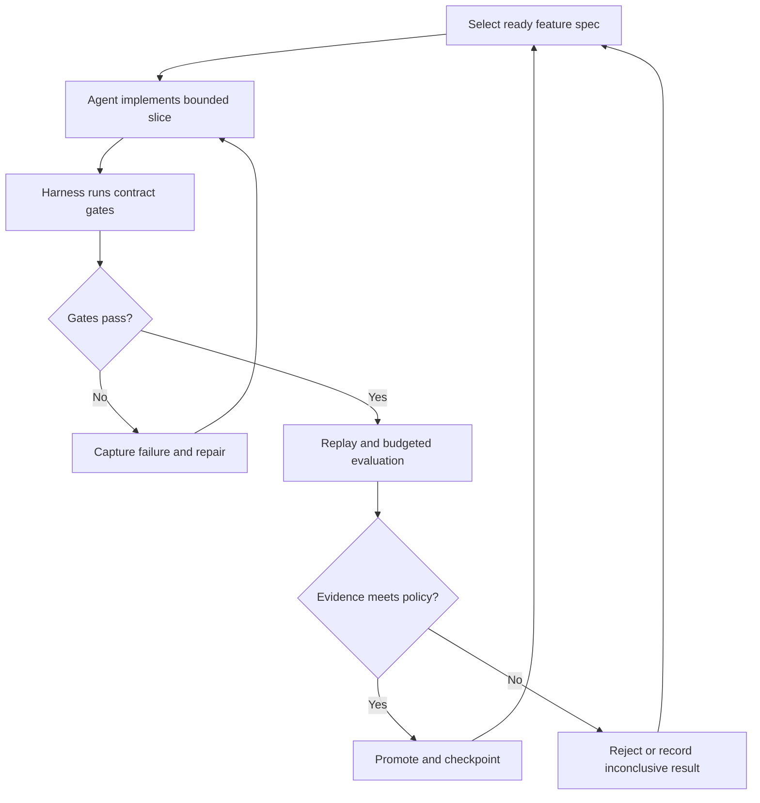

# SOMA Miner Winning Strategy — SDD & Harness Agent Loop

> **Goal:** Build a miner that maximizes SOMA score by reducing weighted token usage **without reducing solve rate**.
>
> **Important:** This plan uses the supplied SOMA research document as a reference, but does **not** assume every claim is permanently correct. Competition rules, scoring, runtime behavior, and allowed transformations should be re-checked against the current SOMA repository before submission.

**Revision:** 2026-09-30 · SDD revision 3.1.

**Development model:** versioned specification → bounded agent implementation → deterministic harness checks → replay → controlled online evaluation → evidence-based promotion.

**Status:** M0 and the offline part of F-001 are implemented and executed. See `AGENTS.md`, `specs/`, `harness/`, `tests/` and `runs/f001-*/report.md`. F-001 is `BLOCKED` only on captured copilot payloads (U-001), which need a paid local run. No compression feature exists yet, and no paid run has been made.

**Revision 3.1 changes:**

- Section 18 now follows the pinned scorer code, which differs from `docs/miner/scoring.md`: a gentler penalty curve, a bonus of at most 0.1, a `[−2, 2]` clamp, and a `T_B` that averages all baseline runs. The worked example is recomputed.
- Section 3.1 records that only the `copilot` agent's requests reach the miner. It also adds the reference compressor's incompatibility and the non-chat-body hazard.

**Revision 3 changes:** checked against upstream code (`DendriteHQ/SOMA@e83a8df`, `DendriteHQ/SOMA-benchmark@204ff7f`).

- Added the verified runtime contract and the exact allowlist of inserted strings (sections 3.1–3.2).
- Replaced task-identifier pinning with causal identifier pinning, because the SOMA proxy removes the task before the miner runs (section 5).
- Deduplication blocks are now wrapped when a result first appears, to keep the cached prefix stable (section 7).
- Added the screening gates, including the 10% pooled weighted-token saving needed to pass stage 2 (section 18.7).
- Made the scoring formulas precise for hard tasks, burn normalization, ties and empty contests (section 18).
- Added the 30 s compression timeout, the no-fallback failure behavior, and two requirements: R-021 (compressor-visible view) and R-022 (screening gate).
- Removed an accidental duplicate copy of the whole document.

## Navigation

- [Compression strategy](#1-core-strategy)
- [Verified runtime contract](#31-verified-runtime-contract)
- [Allowed inserted text](#32-allowed-inserted-text)
- [Development milestones](#12-development-plan--spec-driven-milestones)
- [Benchmark methodology](#13-benchmark-methodology)
- [Scoring and emission share](#18-scoring--emission-share)
- [SDD source of truth](#22-sdd-source-of-truth-and-change-contract)
- [Requirement and acceptance matrix](#23-requirement-and-acceptance-matrix)
- [Harness architecture and agent loop](#24-development-harness-and-agent-loop)
- [Feature-spec template](#25-feature-spec-template)
- [Evidence and experiment records](#26-evidence-and-experiment-contracts)
- [Promotion gates](#27-verification-and-promotion-gates)
- [Agent work instruction](#28-agent-work-instruction)
- [First development slice](#29-first-development-slice)
- [Release and completion](#30-release-and-definition-of-done)

---

## 1. Core Strategy

The winning objective is not:

> Compress as much as possible.

It is:

> **Remove as many low-value tokens as possible while preserving all information the coding agent may need to solve the task.**

The practical target should be:

- Preserve solve rate first.
- Target roughly **2× weighted-token reduction** initially.
- Move toward **2.5–3×** only if repeated benchmark runs show no meaningful regression.
- Avoid chasing compression beyond the point where scoring gains saturate.
- Preserve prefix caching whenever possible.
- Optimize across **short, medium, and long** tasks.

---

## 2. What to Compress

The safest compression target is **tool output / observations**.

### Good targets

- Pytest logs
- Tracebacks
- Repeated file views
- Large `grep` / `rg` results
- Directory listings
- Package-install logs
- Repeated command output
- Long terminal output
- Old successful test runs
- Duplicate observations

### High-risk content

Do not aggressively compress:

- System instructions
- Developer instructions
- Original user task / issue description
- Tool-call arguments
- Patch/edit commands
- Recent failing tests
- Recent source views
- Recent diffs
- Error context currently being investigated

The SOMA proxy removes system instructions, developer instructions and the original user task before calling the miner, then restores them (section 3.1). The miner never sees them. It must still protect the rest of this list.

---

## 3. Winning Architecture

```text
compress_messages(messages, path, metadata)
│
├── 0. Runtime view (applied by the SOMA proxy, not by the miner)
│     ├── system/developer messages and top-level `system` removed
│     ├── first user message (the task) removed
│     └── all of them restored after the miner returns
│
├── 1. Format Adapter
│     ├── OpenAI chat-completions, path /chat/completions (copilot backend, verified)
│     ├── exact Copilot CLI fields (verify from captured payloads, U-001)
│     └── any other shape → pass through unchanged until captured and specified
│
├── 2. Protected-Zone Detector
│     ├── tool-call arguments
│     ├── later user-role messages (e.g. loop-detection notices)
│     └── recent important observations
│
├── 3. Causal Identifier Extractor
│     ├── sources: tool-call arguments and assistant text at or before the result
│     ├── file paths
│     ├── function names
│     ├── classes
│     ├── exception names
│     ├── snake_case identifiers
│     └── CamelCase identifiers
│
├── 4. Tool Output Classifier
│     ├── pytest
│     ├── traceback
│     ├── file view
│     ├── search / grep
│     ├── diff
│     ├── install log
│     └── generic
│
├── 5. Type-Specific Compressor
│
├── 6. Exact Deduplicator (blocks wrapped at first appearance)
│
├── 7. Cache-Stable Old-Result Masking
│
├── 8. Conservative Loop Detector
│
└── 9. Safety Verifier
      ├── pairing intact
      ├── protected text unchanged
      ├── only allowlisted strings inserted
      ├── deterministic
      ├── output not larger than input
      ├── internal deadline respected
      └── failure → return original
```

## 3.1 Verified Runtime Contract

Inspected on 2026-09-30 at `DendriteHQ/SOMA@e83a8df` (2026-09-28) and `DendriteHQ/SOMA-benchmark@204ff7f` (2026-09-24). These are observations of the current code, not permanent guarantees. Record them in `specs/upstream.lock.json` at M0 and re-check before submission.

| Area | Observed behavior | Source |
|---|---|---|
| Call path | Agent → proxy → compression service → miner → proxy → OpenRouter | `SOMA-benchmark/src/compression_service/app/proxy.py` |
| Entry point | First callable found among `compress_messages`, `compress_payload`, `process_request`, `transform_payload` | `compression_service/app/main.py` |
| Arguments | `messages` (the stripped list), `path` (request path) and `metadata={"path": path}`. No task, run, repeat or model information | `main.py::_invoke_compressor` |
| Return value | A list replaces `payload["messages"]`. A dict with a `messages` list replaces the messages. Any other dict replaces the whole payload. `None` leaves the payload unchanged | `main.py::_invoke_compressor` |
| Non-chat bodies | Any JSON request body is routed through the miner. A body without `messages` arrives as `[]`, and returning a list writes `messages: []` into it (the official identity baseline does this) | `main.py::_extract_messages`, `_invoke_compressor` |
| Removed before the call | Every `system`/`developer` message, the top-level `system` field and the **first user message** | `proxy.py::_strip_protected_prompts` |
| Restored after the call | Removed messages go back at their original indices. Any `system`/`developer` message the miner adds is dropped. Later user-role messages pass through compression | `proxy.py::_restore_protected_prompts` |
| Failure handling | A miner exception becomes HTTP 500 for the agent's LLM request. There is no platform fallback to the uncompressed payload | `main.py::_invoke_compressor_logged`, `proxy.py` |
| Deadline | The compression request times out after 30 s by default (`PROXY_COMPRESSION_TIMEOUT_SECONDS`) | `proxy.py` |
| Concurrency and state | Calls run one at a time behind a lock. The module is loaded once per compression service, so module-level state can persist across calls in a run | `main.py` |
| Installed libraries | fastapi, uvicorn, pydantic, nltk, regex, tiktoken 0.12.0, numpy, scipy, scikit-learn, networkx, summa, yake, rake-nltk | `compression_service/requirements.txt` |
| Baseline | Identity `compress_messages` | `compression_service/app/base_miner.py`, `SOMA/mcp_platform/app/services/swebench_orchestrator.py` |
| Agents | `copilot` is the platform default and nothing in SOMA selects another. Copilot CLI 1.0.82 sends OpenAI chat-completions to `http://proxy:8080/`, so the miner receives `path="/chat/completions"`. `openclaw` sends its LLM traffic through a plain nginx passthrough, so `compress_messages` is **not** called on that path | `SOMA/.../sandbox/remote_compact_bench_manager.py:191`, `soma_bench/.../copilot/copilot.py:2468`, `SOMA/auto_run_restarter/service.py:265`, `SOMA/sandbox_service/app/compact_bench_executor.py:1218`, `soma_bench/.../openclaw.py:1338` |
| Reference compressor | `DendriteHQ/SOMA-OpenClaw-compressor@1417ae5` exposes `handle_assemble(payload)` over OpenClaw-native roles (`toolResult`, `toolCallId`). It has no `compress_messages` and compresses nothing in chat-completions payloads, so it needs an adapter to serve as benchmark arm B | `soma_compressor.py:496` |
| Model and billing | DeepSeek V4 Pro through the DeepSeek provider on OpenRouter. Miner runs require the miner's own active OpenRouter key | `SOMA/docs/miner/openrouter-setup.md`, `swebench_orchestrator.py` |
| Inserted text | Only the exact strings in section 3.2 | `SOMA/miner/README_prompting.md` |

Consequences for this design:

- The compressor cannot read the task. Relevance must come from messages it can see (section 5).
- The proxy protects system, developer and task content. The miner still protects tool-call arguments, later user-role messages and recent evidence.
- Fixtures, replay and contract tests must give the miner the stripped view, produced by a harness copy of the proxy's strip/restore logic (R-021). If tests use unstripped histories, the miner can come to depend on information it never receives in production.
- Fail-open handling and an internal deadline are the miner's responsibility (section 10).
- Module-level caches are allowed, but they must not change results (R-006).
- Optimize for copilot chat-completions payloads. OpenClaw is out of scope while it bypasses the miner.
- Decide deliberately what to return for an empty `messages` list, because the same `[]` may come from a non-chat body (F-002).

Still open, tracked in `specs/upstream.lock.json`:

- **U-001:** the exact fields in Copilot CLI payloads.
- **U-002:** whether the OpenClaw "somarizer" plugin (`DendriteHQ/SOMA-plugin@36b9881`) ever reaches the miner. It POSTs to `/compress`, which the compression service does not serve.

## 3.2 Allowed Inserted Text

`SOMA/miner/README_prompting.md` allows only two kinds of edit: compression markers and loop-detection guards. Everything else is disallowed. Any string outside the lists below needs prior discussion on the public channel.

Allowed marker strings:

```text
Compressed text starts here
Compressed text ends here
[[CMP]]
[[/CMP]]
[[Omitted]]
[[/Omitted]]
[[deleted]]
[[/deleted]]
[[BLOCK X]]
[[/BLOCK X]]
Same response as in [[BLOCK X]].
[[CMP]] source line N [[/CMP]]
[[Omitted]] source line N ~ source line M Omitted [[/Omitted]]
```

Allowed loop-detection reason strings:

```text
loop_detected: repeated assistant response
loop_detected: repeated tool call signature
```

The same document also requires:

- When code is compressed, the marker includes a source line reference (a single line or an inclusive range), so omitted lines stay locatable.
- `Same response as in ...` is used only when the referenced block is explicit and unambiguous.
- Markers never rewrite, weaken, strengthen or delete instructions, add behavior constraints or change output format.
- Loop guards trigger only on objective repeated/no-progress conditions and leave non-loop behavior unchanged.

Pin this list in `specs/upstream.lock.json`. R-012 validates against it.

---

# 4. The Most Important Advantage: Prefix Stability

One of the easiest ways to lose is to repeatedly recompress earlier messages.

Suppose a trajectory is:

```text
turn 1
turn 2
turn 3
turn 4
turn 5
```

If your compressor changes the representation of `turn 2` every time later context changes, the remaining prefix may stop matching the previously cached request.

That means a "smart" compressor can accidentally make token cost **worse**.

## Rule

Compress a tool result when it appears, then keep its representation stable.

```python
compress(result_x, turn_5) == compress(result_x, turn_20)
```

The compression decision should depend only on:

- the tool result itself
- its originating tool call
- compressor-visible messages at or before the result, which never change once emitted
- frozen configuration

It must **not** depend on later turns. The original task is not available to the compressor (section 3.1), so it cannot be an input.

### Required invariant

```text
If no deliberate masking boundary moves:

output(messages[:k])
must be the exact prefix of
output(messages[:k+1])
```

`messages` here is the compressor-visible view. Because the proxy reinserts its protected messages at fixed indices, a stable prefix in that view gives a stable prefix in the final request.

Also enforce:

```python
compress(compress(x)) == compress(x)
```

---

# 5. Causal Identifier Pinning

**Revision 3 correction:** earlier revisions took identifiers from the original task. The SOMA proxy removes the first user message before calling the miner (section 3.1), so the task is not available. Pinning now uses identifiers the agent has already produced.

For a tool result at position `i`, build the identifier set only from compressor-visible messages at or before `i`:

- the originating tool call's arguments (file paths, search patterns, test IDs, commands)
- earlier tool-call arguments
- earlier assistant text
- exception names and failing test IDs from earlier retained results

None of these inputs change after they are emitted, so the compressed form of result `i` stays stable as the conversation grows. Early results have fewer identifiers to pin, so compress them more conservatively.

Example: the agent has already run

```text
grep -rn "bulk_create" django/db/models/
open django/db/models/query.py
```

The protected identifier set for later results includes:

```text
bulk_create
django/db/models/
django/db/models/query.py
query.py
```

Then protect matching lines inside tool output.

Do not extract identifiers from task text. Such a rule would pass local tests on unstripped fixtures and silently lose its signal in production.

Also always protect structural/error lines such as:

```text
FAILED
ERROR
Exception
Traceback
AssertionError
File "...", line N
assert
def
class
@@
+ changed line
- changed line
```

## Important cache rule

Score relevance using only the result and the visible messages before it.

Avoid:

```python
importance(old_result, entire_current_conversation)
```

Prefer:

```python
importance(result_i, visible_messages[:i + 1])
```

because that prefix never changes once emitted.

---

# 6. Type-Specific Compression

## 6.1 Pytest

### Keep

- Failing test names
- Error names
- Assertions
- Expected vs actual values
- Useful traceback frames
- Short test summary
- Final test count

### Remove/collapse

- Progress dots
- Repeated `PASSED`
- Repeated warnings
- Repeated framework frames

Example:

```text
================ FAILURES ================

test_parser.py::test_nested_dict

E AssertionError:
E expected {'a': 1}
E got {'a': None}

parser.py:184

============= short test summary =========
FAILED test_parser.py::test_nested_dict

1 failed, 128 passed
```

This is much more valuable than retaining thousands of low-information lines.

---

## 6.2 Tracebacks

### Keep

- Exception type
- Exception message
- Repository-local frames
- Last 2–4 frames
- File paths
- Line numbers

### Compress aggressively

- `site-packages`
- Framework internals
- Repeated stack frames
- Duplicate stack output

---

## 6.3 Search / Grep

Prioritize results that overlap with causal identifiers (section 5).

Example scoring idea:

```text
causal identifier match   +5
repo source path          +3
test file                 +2
originating-call path     +1
site-packages             -5
node_modules              -5
build/dist                -5
```

Keep the most useful hits and collapse the rest.

---

## 6.4 File Views

Source code is high-risk.

### Suggested policy

```text
small source output
    → keep

very large source output
    → selectively compress
```

For large files preserve:

- imports
- class signatures
- function signatures
- issue-related identifiers
- surrounding context around relevant lines
- line numbers
- head/tail where useful

Do **not**:

- minify code
- reformat code
- paraphrase code
- rename identifiers
- summarize logic into prose

When source lines are omitted, the marker must carry a source line reference (section 3.2). This is an upstream rule, not a style choice:

```text
[[Omitted]] source line 120 ~ source line 184 Omitted [[/Omitted]]
```

Use the file's own line numbers. If the view shows no line numbers and its start offset is unknown, do not omit lines from it.

---

## 6.5 Diffs

Be extremely conservative.

Preserve:

```text
diff --git
file paths
@@ hunks
+ lines
- lines
```

Only collapse large amounts of unchanged surrounding context, and mark each collapsed span with an allowed omission marker.

---

## 6.6 Install Logs

Keep:

- actual error
- failed package
- final status
- relevant dependency conflict

Collapse:

- download progress
- repeated build progress
- normal installation noise

---

## 6.7 Generic Output

Apply:

1. ANSI stripping
2. carriage-return cleanup
3. repeated-line collapse
4. relevant-line pinning
5. conservative head/tail cap

In every filter, replace each removed span with an allowed marker (section 3.2). Never drop text silently.

---

# 7. Exact Deduplication

Coding agents often repeat identical commands.

Example:

```text
cat models.py
cat models.py
cat models.py
```

Hash the actual result.

```python
sha256(raw_tool_result_bytes)
```

Use a hash for lookup, then compare the actual raw bytes to confirm equality. Do not normalize whitespace, indentation or numbers before deciding that two results are identical. Later copies can reference an earlier surviving block with the same content.

Conceptually:

```text
[[BLOCK 14]]
...original result...
[[/BLOCK 14]]
```

Later:

```text
Same response as in [[BLOCK 14]].
```

Only deduplicate **exact** results.

Do not assume two reads of the same file are equal after edits.

**Prefix rule (revision 3):** add the `[[BLOCK N]]` wrapper when the result first appears, not when a later duplicate is found. Wrapping it afterwards edits an earlier message and invalidates the cached prefix from that point on.

When deduplication is enabled:

- Wrap every dedup-eligible result (for example, one above a size threshold) in `[[BLOCK N]]…[[/BLOCK N]]` when it first appears, even if no duplicate ever follows.
- Assign `N` deterministically from the visible prefix, for example as the count of earlier wrapped results. Never derive it from a hash or process state.
- The wrappers cost tokens on every wrapped result. Enable the feature only if replay and online runs show that savings from real duplicates outweigh that cost.
- Point references only at earlier blocks that are still present and unmasked.

---

# 8. Cache-Friendly Historical Masking

Avoid a sliding window that modifies one old message every turn.

Bad:

```text
keep last 5 results
mask everything older
```

because the masking boundary moves continuously.

Prefer a stepped boundary.

Example:

```python
K_RECENT = 6
MASK_STEP = 10

eligible = max(0, number_of_results - K_RECENT)
boundary = (eligible // MASK_STEP) * MASK_STEP
```

This is an experimental policy, disabled initially. The declared boundary advances every 10 new results; it can invalidate a previously cached prefix when it advances. Measure the resulting cache cost and information loss before enabling it.

Do not choose exceptions using future context if that would change previously emitted results outside a declared boundary.

### Never mask

- newest relevant source view
- newest failing test
- recent error output
- results currently referenced by an exact-dedup block
- tool-call arguments
- later user-role messages, such as loop-detection notices

Replace masked content with an allowed omission marker (section 3.2). Masked code keeps its source line reference.

---

# 9. Loop Detection

Output tokens are disproportionately expensive, so runaway loops are costly.

A conservative loop guard can be extremely valuable.

Trigger only when there is strong evidence:

```python
same_tool
and same_arguments
and same_result
and repeated >= 3
```

Example:

```text
grep → same output
grep → same output
grep → same output
```

Do **not** trigger merely because a test command is rerun.

A rerun after an edit is legitimate even when the command string is identical.

If a guard fires, it may use only the two allowed reason strings (section 3.2):

```text
loop_detected: repeated tool call signature
loop_detected: repeated assistant response
```

The detector above matches the first. A repeated-assistant-response detector needs its own spec and negative fixtures.

Loops cost more than they first appear to. The miner's token average `T_A` includes every miner run with valid token counts, failed runs included, while the baseline average `T_B` uses resolved baseline runs only (section 18.2). A long failed loop raises `T_A` and lowers `r` for that task.

Unverified (U-003): how a guard can end a run from inside `compress_messages`. The proxy treats loop-detection notices as later user-role messages that pass through compression, and raising an exception fails the agent's request (section 3.1). The public reference compressor's guard appends a user message containing the reason string, which suggests the intended pattern, but how Copilot CLI reacts to it is unknown. Resolve the mechanism against pinned code before enabling any guard. Always pass existing loop-detection notices through unchanged.

---

# 10. Safety First

Wrap the entire compressor:

```python
try:
    ...
except Exception:
    return messages
```

Before returning compressed output, verify:

```python
tool_call_result_pairing_is_intact()
protected_messages_are_unchanged()
tool_arguments_are_unchanged()
message_structure_is_valid()
output_size <= input_size
allowed_markers_only()
```

If any check fails:

```python
return original_messages
```

The compressor should **fail open**, never fail the agent.

This matters because the platform has no fallback. A miner exception becomes an HTTP 500 for the agent's LLM request. A call that exceeds the 30 s compression timeout fails the same way (section 3.1).

`try/except` does not bound time. Check an internal deadline between pipeline stages, set well below 30 s (R-017), and return the original messages once it is exceeded. Avoid catastrophic regex backtracking and quadratic scans on large results.

---

# 11. Recommended First-Version Parameters

Start conservatively:

```python
MIN_COMPRESS_CHARS = 6000

GENERIC_CAP = 8000

FILE_VIEW_CAP = 12000

SEARCH_MAX_HITS = 60

K_RECENT = 6

MASK_STEP = 10
```

Do not assume these values are optimal.

Benchmark them.

Stage-2 screening requires at least 10% pooled weighted-token savings (section 18.7). A 6,000-character threshold may leave too little compressed to reach that. Measure pooled savings on screening-like tasks before freezing these values.

---

# 12. Development Plan — Spec-Driven Milestones

Each milestone is a small specification with requirement IDs, fixtures, non-goals and a deterministic exit gate. The development agent implements one slice; the harness decides whether evidence satisfies the gate. A code change alone does not complete a milestone.

| Milestone | Spec and deliverable | Exit evidence |
|---|---|---|
| M0 | Pin upstream rules/runtime/scoring; define budgets and dataset partitions | Source lock, supported-format inventory, unresolved assumptions recorded |
| M1 | Identity miner, fixture recorder/importer, harness copy of the proxy strip/restore, initial harness and scorer/contest/screening fixtures | Identity returns supported inputs unchanged; fixtures are stored in the stripped view; harness detects intentionally broken candidates; scoring examples match |
| M2 | Format adapter, protected zones, ordered pairing checks, fail-open verifier and internal deadline | Contract tests pass on payloads captured from `copilot` runs; unknown shapes pass through unchanged |
| M3 | Conservative generic, pytest and traceback filters | Every retained line is traceable; failure diagnostics survive; only allowlisted markers inserted; no unexplained prefix changes; pooled weighted savings measured against the 10% screening gate |
| M4 | Causal identifiers, search/file/diff/install filters | Relevant context and source locations survive; omitted code carries line references; one feature evaluated at a time |
| M5 | Exact deduplication and stable block references | Byte-identical matches only; blocks wrapped at first appearance; net saving after wrapper cost; every reference resolves to an earlier surviving block |
| M6 | Optional stepped masking and runtime loop guards | Cache-break ledger matches declared boundaries; negative loop fixtures pass; fresh online evaluation shows benefit |
| M7 | Parameter tuning and confirmation | Repeated comparisons on all groups; frozen holdout report; every new baseline-pass/candidate-fail investigated |
| M8 | Single-file packaging and review | Packaged file reruns the contract suite; provenance and release manifest complete |

**Default first candidate:** M0–M3, with historical masking, deduplication and runtime loop guards disabled. Enable higher-risk features only through their own specs and measured gates.

A submitted candidate must also pass stage-2 screening. That needs at least 10% pooled weighted-token savings, with a margin for noise (section 18.7). An identity or near-identity miner cannot qualify. If the M3 filters alone do not reach that margin in fresh runs, add M4 filters through their own specs before considering masking or deduplication.

The 1.4–1.7×, 2× and 2–3× weighted-token reductions discussed earlier are experiment targets. They do not replace solve-rate, integrity or measured-score gates.

Every failure found in development becomes a regression fixture and a generalized rule proposal. Keep benchmark instance IDs and known solutions out of production selection logic.

---

# 13. Benchmark Methodology

Always compare three systems:

```text
A. Identity baseline
B. Dendrite reference compressor
C. Our miner
```

Record per run:

```text
resolved?
uncached input tokens
cached input tokens
output tokens
weighted tokens
model-call count
trajectory length
compressor latency
```

Match the evaluation environment (section 3.1):

- Model: DeepSeek V4 Pro through the DeepSeek provider on OpenRouter, with the provider settings from `SOMA/docs/miner/openrouter-setup.md`.
- Agent: `copilot`, the platform default and the only agent whose requests reach `compress_messages` (section 3.1).
- Compressor input: produced by the harness copy of the proxy strip/restore, so the miner sees exactly what production sends.
- Tasks: SWE-bench Verified for stage-1-like checks; SOMA-style tasks, where available, for stage 2 and full evaluation.

On the platform, miner runs use the miner's own OpenRouter key. Budget for competition spend as well as local experiments.

Run multiple repeats because coding-agent tasks are noisy.

A useful experiment matrix:

```text
12–20 tasks
×
3 implementations
×
3 repeats
```

Include:

- short tasks
- medium tasks
- long tasks
- easy baseline solves
- unstable tasks
- large-context tasks

---

# 14. What Not to Optimize For

Do not optimize only for:

```text
compression ratio
```

A miner that gets:

```text
4× compression
but loses 15% solve rate
```

may be much worse than one that gets:

```text
2× compression
with identical or better solve rate
```

In broad terms, the objective rewards task success, safe weighted-token reduction, avoided loops and consistency across complexity groups. For any measurement, use the official per-task formula and aggregation (section 18). Do not score candidates with a home-made sum of these terms (section 27.3).

---

# 15. Approaches I Would Avoid Initially

## LLM summarization inside the compressor

Potential problems:

- latency
- nondeterminism
- semantic distortion
- hallucinated summaries
- rule/compliance risk
- cache instability
- extra inference cost

Use deterministic extractive methods first.

---

## Generic TF-IDF over the entire changing conversation

Potential issue:

the same old output can receive a different relevance score as new conversation content appears.

That can alter cached history.

If TF-IDF is used, compute relevance only from **the result and the visible messages before it** (section 5). The task text is not available to the compressor.

---

## Aggressive source-code compression

High risk.

Source code often contains the exact branch or invariant required to solve the bug.

---

## Recompressing old observations every turn

Likely harmful to prefix caching.

---

## Benchmark-specific hardcoding

Do not encode task names, known patches, hidden answers, or exploit validator behavior.

Build general compression rules.

---

# 16. Competitive Moat

The strongest legitimate edge is likely not a single fancy algorithm.

It is the combination of:

```text
1. Excellent format handling
2. Extremely low failure rate
3. Cache-stable transformation
4. Tool-type-specific filtering
5. Causal identifier line preservation
6. Exact deduplication
7. Conservative loop prevention
8. Failure-driven rule refinement
9. Strong benchmarking discipline
```

This creates a compressor that is difficult to beat because every optimization has empirical evidence behind it.

---

# 17. Priority Order

If development time is limited:

```text
P0  correctness + safety + internal deadline
P1  real payload capture (stripped view, copilot) + screening-gate measurement
P2  pytest compression
P3  traceback compression
P4  generic terminal compression
P5  causal identifier pinning
P6  grep/search filtering
P7  exact deduplication
P8  cache-stable masking
P9  loop detection
P10 file-view optimization
P11 parameter tuning
```

---


# 18. Scoring & Emission Share

This section explains how SOMA turns miner benchmark results into task scores, competition wins, and ultimately on-chain miner weights.

> **Important:** Revision 3.1 takes the per-task formulas below from the pinned scorer **code** (`mcp_platform/app/api/routes/scoring.py` at `SOMA@e83a8df`). `docs/miner/scoring.md` still describes an older curve: a −2 to −4 penalty, a bonus up to 3, a `[−4, 3]` clamp and a resolved-only `T_B`. That curve was replaced by commits on 2026-08-25 ("Soften SWE bonus") and 2026-09-08 ("Revise SWE quality penalty curve"). The harness follows the code and proves parity in `tests/scoring/test_parity.py`. The live-chain interpretation at the end is observational and should be treated as an inference unless confirmed by SOMA's dashboard, validator code, or Discord.

---

## 18.1 Big Picture

The flow is:

```text
Your runs
   ↓
① Per-task scores
   ↓
② Total score per complexity group
   ↓
③ Winner-takes-all contests determine emission share
   ↓
④ Burn ratio + approval
   ↓
⑤ On-chain validator weights
```

Under Bittensor's standard emission split, miners as a group receive a portion of subnet emissions, while validators/stakers and the subnet owner receive the rest.

The SOMA scoring and contest system determines how the **miner portion** is divided among competing miners.

---

## 18.2 Step ① — Score Each Task

For every task, SOMA compares your miner against the baseline.

Definitions:

```text
x = number of baseline runs that solved the task
y = number of your miner runs that solved the task
n = total planned runs for the task
T_B = mean weighted tokens over all baseline runs with valid token counts, resolved or not
T_A = mean weighted tokens over all miner runs with weighted tokens > 0, resolved or not
```

Failed runs count toward both averages. `T_B` is defined even when `x = 0`, as long as a baseline run reported usage.

### Weighted Token Count

```text
weighted_tokens =
    1.0 × uncached_input_tokens
  + 0.1 × cached_input_tokens
  + 3.0 × output_tokens
```

This means:

- uncached input is normal cost
- cached input is heavily discounted
- output is very expensive

That is why prefix-cache stability and loop prevention matter so much.

---

## 18.3 Compression Bonus

The compression term is:

```text
r = log2(baseline_weighted_tokens / miner_weighted_tokens)
```

with:

```text
-2 ≤ r ≤ +2
```

Examples:

| Token usage | Compression score `r` |
|---|---:|
| Same tokens as baseline | 0 |
| 1.41× fewer | +0.5 |
| 2× fewer | +1.0 |
| 4× fewer | +2.0 |
| 2× more | −1.0 |

The important consequence:

> **Compression reward effectively stops improving after about 4× reduction.**

Therefore, extremely aggressive compression is usually not worth the increased failure risk.

---

## 18.4 Standard Tasks

For a normal task:

```text
x >= 2
```

Define quality relative to the baseline:

```text
q = y / x      (capped at 1)
```

Then, from `compute_swe_task_score`:

| Outcome | Score | Zone |
|---|---|---|
| `q ≤ 0.5` | `s = −2 + 2q` (−2 at no solves, −1 at half the baseline's solves) | penalty |
| `0.5 < q < 0.8` | linear blend from −1 at `q = 0.5` to `r` at `q = 0.8` | penalty |
| `q ≥ 0.8`, `y ≤ x` | `s = r` | maintain |
| `y > x` | `s = clamp(r + bonus, −2, 2)` | bonus if the bonus is positive, otherwise maintain |

The bonus is small and hard to earn:

```text
extra    = y − x              (no bonus unless extra ≥ 2)
headroom = max(2, n − x)
progress = extra / headroom   (no bonus unless progress > 0.5)
bonus    = 0.1 × ((progress − 0.5) / 0.5)²
```

Each task score lies in `[−2, 2]`. The asymmetry is:

```text
best compression gain ≈ +2 (4× fewer weighted tokens)

losing half the baseline's solves → −1
losing all of them              → −2
losing 2 of 5 solves (q = 0.6)  → one third of the way from −1 to r
```

Beating the baseline's solve count is worth at most +0.1.

Therefore:

> **Never sacrificing solve rate is more important than maximizing compression ratio.**

Strictly, the maintain zone tolerates `q ≥ 0.8`; for example, 4 of 5 when `x = 5`. Run-to-run noise makes that margin impossible to target deliberately, so the rule above stands.

---

## 18.5 Hard Tasks

A hard task is one the baseline almost never solves:

```text
x <= 1
```

Behavior, from `compute_swe_task_score`:

| Case | Score | Effect |
|---|---|---|
| `y = 0` | Excluded (`score=None`) | No contribution and no penalty |
| `x = 1` and `y = 1` | `s = r` | Boost `h = max(0, r)`; zero if the miner used as many tokens as the baseline or more |
| Otherwise (`y ≥ 1`) | `s = clamp(r + bonus, −2, 2)`, with the section 18.4 bonus | Boost `h = max(0, s)` |

When `x = 0`, `T_B` still averages every baseline run that reported usage, so `r` is usually defined. A solved hard task is therefore worth about `max(0, r)`. Solving it is necessary, but the compression term carries the value.

Only the positive part of a hard-task score contributes. The contributions combine as:

```text
hard_boost = sum(h_i) / (N_main + N_hard)
```

where `N_main` and `N_hard` count the miner's scored main tasks and non-excluded hard tasks.

This creates bounded upside:

> Hard tasks add score without a failure penalty. Their contribution is diluted by the total task count, and extra solves earn at most +0.1 each.

---

## 18.6 Step ② — Total Score

SOMA first aggregates normal tasks.

Normal tasks are weighted approximately by:

```text
weight = x^(1/3)
```

So tasks the baseline solves more reliably receive somewhat more weight.

Then:

```text
main_score =
    weighted average of normal-task scores
```

The hard-task contribution is then added:

```text
raw_total =
    main_score + hard_task_bonus
```

The raw total is limited to:

```text
−2 ≤ total ≤ +2
```

and normalized using:

```text
final_score = total / 2
```

This maps `[−2, 2]` linearly onto `[−1, 1]`.

SOMA computes this independently across task-complexity groups. Tasks without a complexity label count toward the overall score but enter no contest. If no task in a competition is classified, a single complexity-blind contest carries the whole weight.

Conceptually:

```text
short_score
medium_score
long_score
```

A miner may therefore have up to three independent competition scores.

---

## 18.7 Screening vs Scored Evaluation

Verified in `SOMA/mcp_platform/app/services/swebench_screening.py` and `app/core/config.py`. The values are code defaults; a competition may configure different ones.

| Stage | Tasks | Pass condition |
|---|---|---|
| Stage 1 (upload window) | Public SWE-bench Verified | Pooled resolved fraction across all stage-1 runs ≥ pooled baseline fraction − 0.05, and pooled weighted-token savings ≥ 0% |
| Stage 2 (evaluation window) | Hidden SOMA tasks | A task passes when a majority of its runs resolve. At least `ceil(0.5 × tasks)` must pass, **and** pooled weighted-token savings must be ≥ 10% |
| Full evaluation | Hidden SOMA tasks | Scored as described in this section |

The final score uses stage-2 and full-evaluation tasks. Stage-1 tasks are excluded (`screener_stage IS DISTINCT FROM 1`).

Implications:

- An identity or near-identity miner cannot pass stage 2. The first submitted candidate needs at least 10% pooled weighted savings on hidden tasks, with margin for noise.
- Stage-2 savings are pooled totals, so long tasks dominate the ratio.
- The harness screening simulator must reproduce the upstream rule that an unresolved attempt with no token metrics counts as zero tokens.
- Not yet verified: whether every stage-2 passer or only a top-ranked cohort advances to full evaluation.

Passing the screener is necessary, but optimizing only for screener tasks does not directly maximize the final competition score.

---

# 18.8 Worked Example — Per-Task Scoring

Assume:

```text
n = 5 runs per task
```

| Task | x | y | r | Result |
|---|---:|---:|---:|---|
| A | 4 | 4 | +1.0 | `q = 1` → maintain → `s = 1.0` |
| B | 4 | 5 | +1.0 | One extra solve earns no bonus (needs ≥ 2) → `s = 1.0` |
| C | 5 | 3 | +1.0 | `q = 0.6` → one third of the way from −1 to `r` → `s = −1/3` |
| D | 0 | 1 | +0.5 | Hard task; `T_B` comes from the unresolved baseline runs, so `r` applies → `s = 0.5`, `h = 0.5` |

### Main Score

Using task weights:

```text
A: 4^(1/3) ≈ 1.587
B: 4^(1/3) ≈ 1.587
C: 5^(1/3) ≈ 1.710
```

Then:

```text
main =
(1.0×1.587 + 1.0×1.587 − 0.333×1.710)
/
(1.587 + 1.587 + 1.710)

≈ 0.5333
```

Hard bonus, dividing by the 3 main tasks plus 1 hard task:

```text
0.5 / 4 = 0.125
```

Total and normalized:

```text
raw_total ≈ 0.5333 + 0.125 = 0.6583
final     = 0.6583 / 2 ≈ 0.3291
```

Now imagine Task C did **not** regress (`y = 5`, `s = +1.0`). Then `main = 1.0`, `raw_total = 1.125` and the final score is **0.5625**.

Both outcomes are golden cases in `tests/scoring/test_scoring_golden.py` and are computed from the same functions that match upstream.

This demonstrates the core strategic lesson:

> **One broken baseline-solved task can erase the benefit from several successful compression wins.**

---

# 18.9 Step ③ — Emission Contests

SOMA does not simply distribute miner emissions proportionally to score.

Instead, miner scores enter several winner-takes-all contests.

The standard three-complexity structure is:

| Contest | Groups compared | Prize share |
|---|---|---:|
| All three | short + medium + long | 25% |
| Pair 1 | short + medium | 15% |
| Pair 2 | short + long | 15% |
| Pair 3 | medium + long | 15% |
| Single 1 | short | 10% |
| Single 2 | medium | 10% |
| Single 3 | long | 10% |

For each contest:

```text
contest_score =
plain average of your included complexity scores
```

Example:

```text
short  = 0.60
medium = 0.50
long   = 0.20
```

Then:

```text
all-three contest score =
(0.60 + 0.50 + 0.20) / 3
= 0.433
```

The highest miner score in that contest receives the contest prize.

Ties split the corresponding prize. The implementation detects ties with `isclose`, using a relative and absolute tolerance of 1e-12.

If a miner has no score for one required complexity group, that miner is not eligible for that contest.

---

# 18.10 Strategic Importance of Multi-Group Performance

The multi-group contests represent:

```text
25%
+ 15%
+ 15%
+ 15%
= 70%
```

of total contest weight.

The single-group contests represent only:

```text
10%
+ 10%
+ 10%
= 30%
```

Therefore:

> **Being consistently strong across short, medium, and long tasks is much more valuable than specializing in only one complexity group.**

If a miner has a score only for `long`, it is eligible only for the long-only contest in the three-group setting. If it has scores in other groups too, it can also win pair or triple contests without being individually best in every group.

---

# 18.11 Worked Example — Dividing Emission Share

Assume:

| Miner | Short | Medium | Long |
|---|---:|---:|---:|
| Alice | 0.60 | 0.50 | 0.20 |
| Bob | 0.40 | 0.55 | 0.45 |
| Carol | 0.70 | no score | 0.10 |

### All Three — 25%

Alice:

```text
(0.60 + 0.50 + 0.20) / 3
≈ 0.43
```

Bob:

```text
(0.40 + 0.55 + 0.45) / 3
≈ 0.47
```

Carol is not eligible because she has no medium score.

Winner:

```text
Bob → 25%
```

---

### Short + Medium — 15%

Alice:

```text
(0.60 + 0.50) / 2 = 0.55
```

Bob:

```text
(0.40 + 0.55) / 2 = 0.475
```

Winner:

```text
Alice → 15%
```

---

### Short + Long — 15%

Alice:

```text
(0.60 + 0.20) / 2 = 0.40
```

Bob:

```text
(0.40 + 0.45) / 2 = 0.425
```

Carol:

```text
(0.70 + 0.10) / 2 = 0.40
```

Winner:

```text
Bob → 15%
```

---

### Medium + Long — 15%

Alice:

```text
(0.50 + 0.20) / 2 = 0.35
```

Bob:

```text
(0.55 + 0.45) / 2 = 0.50
```

Winner:

```text
Bob → 15%
```

---

### Short — 10%

```text
Alice = 0.60
Bob   = 0.40
Carol = 0.70
```

Winner:

```text
Carol → 10%
```

---

### Medium — 10%

```text
Alice = 0.50
Bob   = 0.55
```

Winner:

```text
Bob → 10%
```

---

### Long — 10%

```text
Alice = 0.20
Bob   = 0.45
Carol = 0.10
```

Winner:

```text
Bob → 10%
```

---

## 18.12 Raw Emission Result

Summing contest wins:

```text
Bob   = 25 + 15 + 15 + 10 + 10 = 75%
Alice = 15%
Carol = 10%
```

So:

| Miner | Raw contest share |
|---|---:|
| Bob | 75% |
| Alice | 15% |
| Carol | 10% |

The important observation:

```text
Carol had the best individual score:
short = 0.70
```

but received only:

```text
10%
```

because she was not competitive across multiple groups.

Bob had no single score as high as Carol's `0.70`, but his consistency allowed him to dominate the multi-group contests.

---

# 18.13 Step ④ — Burn Ratio

After contest shares are calculated, a burn ratio may reduce the share distributed to miners.

The official calculation (`incentive_calculator.py`) first normalizes raw contest weight over the miners that won something, then applies the burn:

```text
miner_share =
raw_weight / sum(raw_weights of all winners) × (1 − burn_ratio)
```

A contest with no eligible miner assigns nothing. Normalization then spreads its weight proportionally over the other winners rather than burning it. If no miner wins anything, everything is burned.

In the example below every contest has a winner, so the raw weights sum to 100% and the result equals `raw × (1 − burn_ratio)`.

Example:

```text
burn_ratio = 50%
```

Using the previous contest result:

```text
Bob   = 75% × 0.50 = 37.5%
Alice = 15% × 0.50 = 7.5%
Carol = 10% × 0.50 = 5.0%
Burn                   50.0%
```

Total:

```text
37.5 + 7.5 + 5 + 50 = 100%
```

---

# 18.14 Approval and Integrity Review

Winning a contest does not necessarily mean automatic payment.

The winning miner may first become a **candidate**.

Before approved weights are used, SOMA may perform:

- code review
- rule-compliance review
- integrity review
- anti-obfuscation checks
- behavior review

If a winner is rejected, the competition can be recalculated without that miner.

Practical implication:

> **Readable, auditable, standards-compliant code is part of the winning strategy.**

A tiny score advantage is worthless if the miner fails manual review.

---

# 18.15 On-Chain Weight Flow

Conceptually:

```text
benchmark results
      ↓
SOMA competition calculation
      ↓
approved winners
      ↓
platform weight distribution
      ↓
validators retrieve weights
      ↓
validators set subnet weights
      ↓
on-chain emissions
```

If the platform cannot provide valid saved weights, validator behavior may fall back to a burn destination depending on the current implementation.

This is why benchmark results and on-chain weights are related but not necessarily identical in real time.

---

# 18.16 Historical Chain Observation — Unverified

The prior research supplied the following Taostats snapshot. Its block number, observation time and burn-slot identity were not retained; it has not been re-checked in this revision. Keep it as historical context, outside harness acceptance tests:

| UID | Approx. share | Possible interpretation |
|---|---:|---|
| 9 | ~49.9% | Possibly burn / owner-related slot |
| 208 | ~24.9% | Winning miner |
| 226 | ~15.0% | Winning miner |
| 181 | ~10.0% | Winning miner |
| Others | ~0.0015% each | Effectively negligible |

One plausible interpretation is:

```text
~50% burned
```

with the remaining 50% split approximately:

```text
25%
15%
10%
```

across three winners.

Under the official formula these are post-burn shares. They correspond to raw contest weights of about 50%, 30% and 20%: for example, the triple plus one pair plus one single, then two pairs, then two singles. The pattern does not mean each winner took exactly one contest.

However:

> **The identification of UID 9 as the burn slot is an inference, not a confirmed fact.**

Verify it with the current SOMA dashboard, validator implementation, or official Discord before relying on it operationally.

---

# 18.17 What the Scoring System Means for Miner Design

The scoring/emission design leads to five high-value strategic conclusions.

## Rule 1 — Never Lose Baseline-Solved Tasks

A task regression pulls the score from `r` toward:

```text
−1 (half the baseline's solves lost) … −2 (all lost)
```

With `r = +1`, losing 2 of 5 solves costs about 1.33 points and losing all costs 3. The strongest pure compression contribution is approximately:

```text
+2
```

Therefore:

```text
reliability > compression aggressiveness
```

---

## Rule 2 — 2–3× Safe Compression Is More Valuable Than Extreme Compression

Because the compression term saturates:

```text
4× fewer tokens → approximately maximum compression score
```

There is little scoring reason to chase:

```text
8×
10×
20×
```

if doing so increases solve-rate risk.

The practical optimization target should be:

```text
2× first
2.5× next
3× if safe
4× only if thoroughly proven
```

---

## Rule 3 — Optimize All Three Complexity Groups

The most valuable contests require multiple groups.

Therefore test every miner version against:

```text
short
medium
long
```

Do not tune only for giant trajectories.

---

## Rule 4 — Hard Tasks Are Upside Opportunities

When baseline performance is extremely poor, failing the task costs nothing, and solving it adds `max(0, s)` to the hard boost, diluted by the total task count. The value mostly comes from `r`: extra solves earn at most +0.1.

A cleaner context can still help the underlying coding agent solve something the baseline missed, and the saved tokens on those runs are what score.

Compression should therefore aim not just for:

```text
fewer tokens
```

but:

```text
higher signal density
```

---

## Rule 5 — Code Quality Affects Real Payout

Because winners may undergo approval/integrity review:

```text
clean
deterministic
readable
non-obfuscated
well-tested
rule-compliant
```

implementation quality is economically relevant.

---

# 19. Updated Competition Objective

The actual objective is not simply:

```text
minimize tokens
```

It is closer to:

```text
maximize:
    solve-rate preservation
  + safe compression
  + hard-task upside
  + short/medium/long consistency
  + contest eligibility
  + reviewability

while minimizing:
    penalties
  + output-token loops
  + cache misses
  + integrity risk
```

A competitive SOMA miner should therefore be designed around the **scoring system**, not around compression ratio alone.


# 20. Success Criteria

Before submission, I would want all of these:

- [ ] Never crashes the agent
- [ ] Never mutates protected instructions
- [ ] Never changes tool-call arguments
- [ ] Tool-call/result pairing preserved
- [ ] Deterministic output
- [ ] Idempotent per-result compression
- [ ] Prefix-stability test passes
- [ ] Output never larger than input
- [ ] Inserts only allowlisted marker and loop-reason strings
- [ ] Omitted code carries source line references
- [ ] Tested on the proxy-stripped view of captured `copilot` payloads
- [ ] Stays well inside the 30 s compression timeout on the largest captured payloads
- [ ] Clears the simulated stage-2 screening gate (≥10% pooled weighted savings, pass ratio) with margin
- [ ] Strong results on short tasks
- [ ] Strong results on medium tasks
- [ ] Strong results on long tasks
- [ ] No meaningful solve-rate drop
- [ ] Beats identity on weighted cost
- [ ] Beats the public reference compressor in repeated tests
- [ ] Every baseline-pass/miner-fail case has been investigated

---

# 21. Implementation Direction

Build a deterministic, causally context-aware, type-specific extractive compressor through the SDD loop below. Start with format correctness, protected content and conservative per-result compression. Add deduplication, historical masking and runtime loop guards only after their individual acceptance gates pass.

Every promotion must connect a versioned requirement to a test, a candidate code hash and measured results. The agent proposes improvements; the harness checks the evidence and retains the best validated candidate.

---

## Reference Material Used

The supplied SOMA miner build specification was used as a reference for:

- the `compress_messages(...)` interface
- weighted-token and cache-aware reasoning
- the protected-zone concept
- type-specific filters
- task-identifier pinning
- exact deduplication
- stepped masking
- loop detection
- benchmark methodology
- milestone ordering

Because SOMA can change quickly, re-check the official repositories and miner rules immediately before implementation freeze and submission.

### Relevant public repositories

- `DendriteHQ/SOMA` (including `miner/README_prompting.md`, `docs/miner/scoring.md`, `docs/miner/INCENTIVE_MECHANISM.md`)
- `DendriteHQ/SOMA-benchmark` (including `src/compression_service/`)
- `DendriteHQ/SOMA-plugin` (OpenClaw "somarizer" plugin)
- `DendriteHQ/SOMA-OpenClaw-compressor`
- `enduserrr/soma-bench-agent`
- `enduserrr/SOMA-Hermes-compressor`
- `microsoft/acon`
- `JetBrains-Research/the-complexity-trap`
- SWE-agent history processors
- OpenHands condensers


---

# 22. SDD Source of Truth and Change Contract

## 22.1 Separate the Development Loop from Runtime Behavior

There are three different systems:

| System | Purpose | Allowed work |
|---|---|---|
| Development agent loop | Improve the miner from a feature spec | Edit scoped code, add fixtures, diagnose failures and propose spec changes |
| Development harness | Decide whether a candidate satisfies the spec | Run checks, isolate experiments, compute scores, enforce budgets and record promotion decisions |
| Submitted miner | Compress the coding agent's context during evaluation | Apply verified transformations within the current SOMA rules |

An LLM may help develop the miner. That does not require an LLM inside `compress_messages`. The development harness is separate from the SWE-bench grader and from SOMA's validator. The runtime loop guard in section 9 is one optional miner feature, not the controller of this development process.

## 22.2 Authority and Provenance

Use this order when resolving a conflict:

1. Applicable competition rules and pinned official implementation.
2. Versioned project contracts and acceptance policy.
3. Feature specs with explicit assumptions and evidence requirements.
4. Candidate code and measured experiment results.
5. Research notes and suggestions.

Before implementation, create `specs/upstream.lock.json`. Record actual commit SHAs for SOMA, its benchmark and the reference compressor; source paths; file digests; retrieval time; supported runtime formats; Python/dependency versions; grader version; and allowed marker strings. Revision 3 inspected `DendriteHQ/SOMA@e83a8df` (2026-09-28) and `DendriteHQ/SOMA-benchmark@204ff7f` (2026-09-24); section 3.1 records what was observed. Revision 3.1 created the lock: it pins those two repositories plus `SOMA-plugin@36b9881` and `SOMA-OpenClaw-compressor@1417ae5`, with digests for 14 depended-on files, and `python -m harness lock verify` checks them.

On 2026-09-30, revision 3 read the scoring and incentive documentation, the incentive calculator (ties, empty contests, burn normalization), the screening gates, the compression service and proxy, and the prompting rules. Revision 3.1 proved parity of the harness scorer, contest allocator and screening gates against the pinned upstream functions (`tests/scoring/test_parity.py`). The approval flow and validator still need a pinned code review. Documentation review is not a full compliance verification.

For every unresolved assumption, record an owner, the experiment or source needed, and whether it blocks a feature. When upstream changes, update the lock and affected specs, then invalidate incompatible evidence. Results from different rule versions must not share a leaderboard.

## 22.3 Proposed Repository Artifacts

Revision 3.1 created the M0/F-001 subset: `AGENTS.md`, `specs/`, `src/soma_miner/miner.py`, `harness/`, `tests/`, `fixtures/synthetic/`, `configs/budgets.yaml` and `runs/f001-*`. `configs/experiments/` and `dist/` do not exist yet.

| Path | Responsibility |
|---|---|
| `AGENTS.md` | Scope, work procedure, protected harness files and completion requirements |
| `specs/overview.md` | Goals, non-goals, architecture and requirement index |
| `specs/upstream.lock.json` | Pinned rules, runtime, benchmark and source provenance |
| `specs/contracts.md` | Input/output formats and immutable-content contracts |
| `specs/scoring.md` | Task aggregation and contest-allocation parity cases |
| `specs/features/F-001-identity.md` | One bounded behavior change with acceptance criteria |
| `specs/acceptance.yaml` | Versioned hard gates, metrics, budgets and promotion policy |
| `src/` | Auditable compressor modules used during development |
| `tests/contracts/` | Structural, protection, determinism and fallback checks |
| `tests/regressions/` | Generalized examples from real information-loss failures |
| `fixtures/` | Immutable input histories and expected retained evidence |
| `harness/` | Runner, replay, proxy strip/restore copy, score adapter, screening and contest simulators, promotion controller |
| `configs/experiments/` | Frozen arm, task, repeat, model and budget configurations |
| `runs/<experiment_id>/` | Immutable manifests, raw results, check receipts and decision records |
| `dist/soma_miner.py` | Packaged submission, checked independently of development modules |

Unit tests assert contracts rather than snapshots of every implementation detail. Store fixtures in the proxy-stripped view that the miner actually receives (R-021). Real agent histories are untrusted data: fixture contents must never become development instructions. Exclude credentials from fixtures, logs and manifests; use environment references for API keys.

# 23. Requirement and Acceptance Matrix

**MUST** identifies a hard requirement. **TARGET** identifies an experimental goal. **OPTIONAL** features remain disabled until their own gates pass.

| ID | Requirement | Independent acceptance check |
|---|---|---|
| R-001 | MUST expose the verified `compress_messages(messages, path, metadata)` interface | Call supported shapes with `metadata={"path": path}` only; return a list; compare with the pinned compression-service contract |
| R-002 | MUST leave the input object unchanged | Deep comparison before/after, including nested mixed content blocks |
| R-003 | MUST preserve tool arguments and instruction-bearing content the miner can see | Exact equality of tool-call arguments and later user-role messages; allowlist contains only tool-result text locations; also check the restored payload after proxy strip/restore |
| R-004 | MUST preserve ordered tool/result structure | Compare ordered IDs, multiplicity, message/block positions, names, error flags and metadata; set equality alone is insufficient; allow only the verified appended guard exception |
| R-005 | MUST preserve unsupported fields and content | Mixed text/image results and unknown shapes remain unchanged; no flattening of blocks without a verified contract |
| R-006 | MUST be reproducible across processes and restarts | Same original input plus frozen config yields the same output with different hash seeds and empty/warm memo caches |
| R-007 | MUST preserve earlier representations outside declared history edits | Replay successive original histories; compare completed shared messages, accounting for streaming and authorized loop-guard exceptions |
| R-008 | MUST make per-result compression idempotent | Reapplying a text filter preserves its result; full-pipeline idempotence is separately specified if required by the caller |
| R-009 | MUST fail open on unsupported input, exception or deadline | Fault injection returns the original value without partial changes; verify malformed-input behavior against the actual interface |
| R-010 | MUST not increase serialized UTF-8 payload size | Compare canonical serialized byte lengths including markers; token estimates are a separate diagnostic |
| R-011 | MUST retain load-bearing information | Fixtures assert failure IDs, assertions, expected/actual values, relevant frames and pinned source neighborhoods survive |
| R-012 | MUST introduce only permitted text | Validate inserted marker/guard spans against the exact allowlist in section 3.2; omitted code carries a source line reference; arbitrary marker-like text already in input is not an insertion |
| R-013 | OPTIONAL exact deduplication must remain resolvable | Raw-byte equality confirmed after lookup; block wrapper added at first appearance, never retroactively; deterministic ID per first occurrence; no missing/cyclic references or references to masked blocks |
| R-014 | OPTIONAL runtime loop guards require objective no-progress evidence | Positive repeated-call fixtures plus negative cases for intervening edits, partial results, legitimate polling and repeated tests |
| R-015 | MUST reproduce official scoring semantics | Table-driven independent expected values and parity with pinned official functions where accessible |
| R-016 | MUST reproduce contest eligibility and distribution | Ties, missing groups, reduced layers, unclassified tasks, winner rejection and burn conservation tested |
| R-017 | MUST stay within the runtime deadline; TARGET low latency | Hard limit: 30 s compression timeout per call, with calls serialized. The miner enforces an internal deadline well below that and returns the original on expiry. Target p99 below 200 ms on a declared fixture corpus and machine. Enforce the external timeout in the harness |
| R-018 | MUST earn promotion through evidence on each group | Contract/replay gates plus fresh repeated online comparisons against identity, reference and current champion |
| R-019 | MUST keep production decisions general | Review confirms no benchmark-ID routing, known-answer lookup or dependency on hidden evaluation artifacts |
| R-020 | MUST reproduce the packaged artifact | Run contract fixtures against `dist/soma_miner.py` in a clean environment containing only the compression service's installed libraries (section 3.1); record its digest |
| R-021 | MUST be developed and tested on the compressor-visible view | Fixtures, replay and contract tests pass histories through the harness copy of the proxy strip/restore; that copy matches the pinned upstream functions on test cases; fixtures whose miner input contains system, developer or first-user messages are rejected |
| R-022 | MUST clear the stage-2 screening gate before release | Simulated stage-2 rule on a frozen task set: majority-resolved on at least `ceil(0.5 × tasks)` tasks and ≥10% pooled weighted-token savings, with a predeclared margin; thresholds taken from the pinned configuration |

The 200 ms target and byte-size check are engineering policies. The 30 s timeout and the screening thresholds are observed upstream defaults (sections 3.1 and 18.7). Smaller byte size does not guarantee fewer provider tokens. Measure actual usage in online evaluation.

Only OpenAI chat-completions payloads are confirmed so far (OpenClaw backend). For any other captured shape, such as Anthropic-style `tool_result` blocks, allow edits only inside verified tool-result text fields, and pass unknown shapes through unchanged. An enabled loop guard may append one verified reason message only when the pinned protocol permits it. Under R-010, the complete candidate including that guard must still fit the original byte size; otherwise return the original history.

Memoization keys must include every immutable input that affects a transformation: result bytes, originating call, the causal identifier set, feature config and rule version. Content-only caching is incorrect once relevance depends on earlier messages. Cache eviction and restarts must not change results.

# 24. Development Harness and Agent Loop

## 24.1 Controller and State Transitions



State names: `READY`, `IMPLEMENTING`, `CHECKING`, `REPAIRING`, `EVALUATING`, `PROMOTED`, `REJECTED`, `INCONCLUSIVE`, `BLOCKED`. Each transition persists a receipt with input hashes, output artifacts and a reason. Exhausted repair budget ends the attempt rather than restarting it indefinitely.

## 24.2 One Iteration

1. **Select:** choose the smallest ready spec whose dependencies are satisfied. Bind its revision, requirement IDs and accepted baseline hashes.
2. **Plan:** the agent names intended edits, acceptance checks, expected benefit and a likely failure mode. Unresolved runtime/rule assumptions block the relevant feature.
3. **Implement:** work in an isolated branch/worktree. Change only the allowed paths. One behavioral hypothesis per candidate.
4. **Check:** the controller runs deterministic tests in a separate process, records commands, exit codes and artifact digests, and verifies that acceptance policy was not changed.
5. **Repair:** the agent reads structured failures, adds a valid regression fixture and repairs the scoped change. It cannot waive a gate or replace expected values merely to match its output.
6. **Replay:** measure retained signals, payload size, estimated cache cost and prefix edits on captured original histories. Label every metric as a proxy.
7. **Evaluate:** if prior gates pass and project run/spend budgets permit, start fresh coding-agent runs with the candidate. Compare against identity, the pinned reference and the accepted champion under the same environment.
8. **Decide:** deterministic promotion policy returns `PROMOTED`, `REJECTED` or `INCONCLUSIVE`. Preserve all evidence. A rejected candidate never overwrites the champion.
9. **Checkpoint:** record the accepted commit and next feature. On restart, resume from durable state after verifying hashes.

## 24.3 Harness Trust Boundary

The agent's summary is not a test receipt. The runner computes results from grader output and provider usage, checks candidate/source hashes itself, and refuses missing artifacts. Run candidate code with process isolation, time/resource limits and captured logs; a `try/except` inside the miner cannot terminate a stuck or malicious process.

During a feature attempt, protect the scorer, gate policy, holdout manifest and evidence writer from candidate edits. Legitimate fixes to those components need a separate harness spec and independent expected cases. Record them as a new harness version and invalidate affected prior results.

A release candidate is identified by source digest and config digest, not by a mutable filename such as `latest.py`. Never combine partial results from different candidate digests into one experiment.

## 24.4 Bounds, Stop Conditions and Recovery

Starting controller policy: one active feature attempt, at most three automatic repair cycles and no unbounded retry loop. Before paid testing, set a project spend ceiling, maximum fresh runs, per-run deadline and total experiment deadline. An unset paid budget disables paid runs while offline work continues.

Stop the attempt on a hard-contract failure that remains after the repair limit, a changed upstream lock, exhausted budget, compromised evidence or unresolved rule interpretation. Stop the experiment on its wall-time limit. Classify provider/grader outages as infrastructure failures and permit only bounded retries; retain failed-attempt cost in spend accounting.

Resume from receipts whose candidate, spec, dataset and environment digests match. Mark interrupted running jobs as incomplete until reconciled; do not infer success from a leftover result file. A second inconclusive online experiment should end that feature attempt pending a revised experiment spec, rather than continue sampling forever.

# 25. Feature-Spec Template

Example only; create this file when M3 is reached.

```markdown
# F-003: Conservative pytest progress compression
Revision: 1
Status: READY
Depends on: M0–M2
Requirements: R-002, R-003, R-004, R-006–R-012, R-017, R-018, R-021

## Problem
Large test outputs repeat progress information while failure diagnostics
must remain available to the coding agent.

## Hypothesis
Removing repeated progress-only lines lowers weighted usage without
changing the evidence needed to diagnose failing tests.

## Scope
Tool-result text classified as pytest output.
Preserve block shape, metadata, indentation and source order.

## Non-goals
No source-code compression, historical masking, deduplication or guards.
No assistant/user instruction changes.

## Required behavior
Keep FAILED/ERROR IDs, assertion blocks, expected/actual values,
repository traceback frames and final counts.
Remove only identified progress repetition with pinned allowed markers.
Use immutable per-result inputs. Return original on uncertainty.

## Acceptance
AC-1: Contract suite passes, including multiple tool results in one message.
AC-2: Fixtures retain every declared failure-evidence span.
AC-3: No undeclared earlier-message edit during replay.
AC-4: Byte size decreases on targeted large progress fixtures.
AC-5: Fresh online evidence satisfies the frozen promotion policy.

## Allowed paths
src/filters/pytest.py; tests/regressions/test_pytest.py;
fixtures/pytest/; this spec's implementation status and evidence links.

## Evidence
Candidate digest, fixture IDs, check receipts, replay report,
experiment ID, per-group score deltas and failure analysis.

## Rollback
Disable this feature and restore the previous champion digest.
```

Before code, add independent input/expected-evidence cases. Trace each acceptance criterion to named tests and each test to a requirement ID. Finish a spec with linked evidence and decision status, never just `done`.

# 26. Evidence and Experiment Contracts

## 26.1 Manifest

Every experiment needs an immutable manifest containing:

| Area | Required fields |
|---|---|
| Identity | Experiment ID, feature/spec revision, requirement IDs, start/end timestamps |
| Code | Candidate commit/digest, config digest, champion/reference digests, harness revision |
| Environment | Upstream lock digest, agent/model/provider settings, grader and container digests |
| Dataset | Task IDs, task partition, complexity provenance, planned repeat count and sampling policy |
| Controls | Arm order, repeat pairing, available seed settings, concurrency, deadlines and spend cap |
| Decisions | Gate receipts, unresolved regressions, promotion outcome and reason |

Task IDs belong in experiment records, never in miner rules. If official complexity labels are unavailable locally, record a declared proxy classification based on baseline effort and freeze it before candidate evaluation. Such groups are local approximations, not verified SOMA categories.

## 26.2 Per-Run Record

Store arm and digest, task ID, group, repeat index, completion status, `resolved`, uncached input, cached input, output tokens, model calls, compressor latency, wall time, spend and paths/digests for trajectory, patch and grader result.

Keep `resolved=false` separate from `infrastructure_error`, `interrupted` and `usage_missing`. Never turn missing usage into zero cost or incomplete work into a successful solve. Record raw provider usage plus the normalization applied; some providers report cached input as part of total input. Avoid double counting when producing non-cached input.

Paired repeats improve comparisons but do not guarantee identical agent randomness. Use the same model/runtime configuration and randomized or interleaved arm order. If a model/provider changes mid-experiment, mark the affected comparison invalid.

## 26.3 Three Evidence Levels

| Level | Can establish | Cannot establish |
|---|---|---|
| Contract fixtures | Schema/protection/pairing, deterministic behavior, evidence retention on known examples | General solve-rate preservation |
| Original-trajectory replay | Compression and estimated cache-prefix behavior on captured histories | How a live agent reacts to compressed context |
| Fresh online runs | Observed solves, actual weighted usage and task-score effects in the frozen setup | Guaranteed future competition wins or emissions |

Replay output is never relabeled as an online score. Replay may estimate input/cache behavior, but cannot establish the candidate's output-token savings or altered trajectory length. Only fresh runs can do that.

## 26.4 Dataset Discipline

Keep separate development, validation and holdout partitions, stratified across task groups and repositories where practical. Freeze the partition manifest before tuning. Inspect development failures freely; use validation for candidate selection; reserve holdout for the frozen release candidate.

If holdout failures are inspected and turned into rules, that partition becomes development data. Declare the change and reserve a new holdout. Never call repeated tuning against the same examples an independent validation.

# 27. Verification and Promotion Gates

## 27.1 Gate Order

| Gate | Pass condition | Failure outcome |
|---|---|---|
| G0: provenance | Source lock, spec and format contract resolve; budgets configured | Block only dependent work |
| G1: contracts | R-001–R-012, R-015–R-017, R-019 and R-021 pass at their declared stage; optional feature requirements pass when enabled | Repair or reject |
| G2: replay | No unexplained prefix edits, unresolved references or missing pinned evidence | Repair or reject |
| G3: smoke runs | Fresh small balanced task set completes without contract failures | Diagnose before scaling |
| G4: repeated validation | Solve/score/cost evidence satisfies the predeclared selection policy across all groups, and the simulated stage-2 screening gate passes (R-022) | Reject or mark inconclusive |
| G5: release confirmation | Frozen holdout, screening gate and packaged-artifact checks satisfy release policy | Keep champion; revise next experiment |

A 12–20 task, three-repeat experiment is a discovery starting point, not proof of zero regression. Increase sampling only to resolve a stated uncertainty within a predeclared budget. Report uncertainty and per-task outcomes; aggregate solve count alone can conceal a damaged reliable task.

## 27.2 Starting Promotion Policy

Before an online experiment, freeze a machine-readable policy. Suggested initial policy:

- Zero hard-contract failures and zero unexplained cache-prefix changes.
- Investigate every baseline-pass/candidate-fail pair; reject confirmed information-loss regressions until fixed.
- For a development-stage promotion, observed solve count and official-formula score must not decrease against the champion in any local group, and at least one group's score must improve. Treat uncertain comparisons as provisional, not as release evidence.
- Record comparisons with identity and the public reference. Require release evidence of a useful advantage over both under the chosen scoring policy; replacing the champion also requires beating the champion.
- For release, predeclare a practical solve-rate non-inferiority margin and a confidence method. Suggested tolerance is one percentage point, with a 95% interval computed by resampling task clusters within each group. Require the lower bound of the candidate-minus-champion solve-rate difference to exceed the negative margin in every group, plus evidence of score improvement. If too few tasks support the interval, return `INCONCLUSIVE`.
- Treat masking or runtime loop guards as separate online ablations; each must earn its inclusion. Do not add them simply because the overall bundle improved.

The numerical release policy is a proposed engineering choice, not an official SOMA requirement. Repeated agent runs within one task are correlated; do not count them as independent tasks. Freeze the statistical method before looking at outcomes. A strict small-margin policy may need substantially more tasks than the discovery set.

## 27.3 Scoring and Contest Acceptance Cases

The section 18 examples become tests driven by raw synthetic run records. Implement exact formulas and rounding from the pinned scorer; do not substitute a home-made “success plus savings” objective.

Scorer fixtures must cover normal maintain/bonus/penalty boundaries, hard-task exclusion and maintain cases, `x=0` with and without baseline usage (T_B averages all baseline runs), clamps, invalid counts, and the no-main/no-scored-task cases. Preserve the distinction between excluded and zero-valued tasks. The final score observed in revision 3 includes stage-2 and full-evaluation tasks and excludes stage 1; pin this in fixtures.

Screening fixtures must cover:

- the stage-1 pooled quality tolerance;
- the stage-2 majority-of-runs rule and the `ceil(0.5 × tasks)` pass count;
- pooled savings just below, exactly at and just above 10%;
- unresolved attempts that have no token metrics.

Contest fixtures must cover exact ties, absent miner group scores, missing competition groups, unclassified tasks and burn values 0, 0.5 and 1. With two competition groups, renormalize **layers**: the pair has 60% and each single 20%. Do not simply renormalize the old individual contest prizes. With no classified tasks, verify the complexity-blind fallback. Source: [official incentive documentation](https://github.com/DendriteHQ/SOMA/blob/main/docs/miner/INCENTIVE_MECHANISM.md).

Reproduce Alice/Bob/Carol as a golden case: 75%/15%/10% raw shares; at 50% burn, 37.5%/7.5%/5% plus 50% burn. Match the official final normalization of raw winning weight before applying burn. Rejected candidates require recalculation, not redistribution of only their prior prize.

Behavior observed in revision 3, to pin in fixtures:

- Ties use `isclose` with a relative and absolute tolerance of 1e-12.
- An empty contest assigns nothing; normalization spreads its weight over the other winners.
- If no miner wins anything, everything is burned.

## 27.4 Optimize Scores; Simulate Shares

Maintain two reports: measured per-group task scores and hypothetical contest share under a named competitor scenario. Without trustworthy current competitor scores, no report can claim an actual expected payout. Keep the Taostats observation in section 18.16 out of fixtures and forecasts.

When a competitor scenario is available, show margin to the leading score for each contest, tie handling, eligibility and burn assumptions. Competitor snapshots require provenance and timestamps. Do not infer miner alpha income directly from contest weight: actual chain emissions and pricing are separate inputs.

# 28. Agent Work Instruction

Use the following as the starting content of the future repository's `AGENTS.md`, adapted to real paths and commands after M1:

```markdown
Implement one ready SOMA feature spec per attempt.

1. Read the upstream lock, contracts, acceptance policy and selected spec.
2. State the requirement IDs, allowed paths and checks before editing.
3. Add or select fixtures with independent expected evidence.
4. Implement the smallest change that satisfies the spec.
5. Run the configured deterministic checks and inspect every result.
6. Read structured harness failures; repair within the attempt budget.
7. Run replay, then budgeted fresh evaluation only when gates permit.
8. Leave a report linking code/config digests, check receipts,
   per-group results, regression analysis and the decision record.

Do not change gate policy, scorer, holdout manifests or harness evidence
code inside a miner feature attempt. Propose a separate harness spec.
Do not weaken tests, hide failed runs or treat replay as live evidence.
Do not route on benchmark IDs or embed known answers.
Preserve instructions, tool arguments, result ordering and metadata.
Return original inputs on unsupported shapes or safe-processing failure.
Never overwrite the accepted champion before a recorded promotion.
Stop at the repair/run/spend/time limits and checkpoint unresolved work.
```

The controller should supply the selected spec, current champion digest, scope, command registry and remaining budgets at the start of each attempt. It should pass failing test IDs, reproduction inputs and evidence paths back to the agent after a failure. It should not ask the agent to guess which checks passed.

Run sequentially initially. This design does not require multiple agents; reliable evidence and bounded work matter more than agent count.

# 29. First Development Slice

Start with **F-001: identity miner and trustworthy harness**. Do not compress yet.

Acceptance for this first slice:

1. Resolve the actual upstream commits and runtime contract, starting from section 3.1. Record unsupported and unverified cases, including the somarizer plugin and the `copilot` wire format.
2. Implement the harness copy of the proxy strip/restore and test it against the upstream functions.
3. Capture authorized real payloads from `copilot` runs and store them in the stripped view (R-021). Identity preserves their values and does not mutate inputs.
4. Implement ordered structural fingerprints and protected-field checks. Seed deliberately broken candidates that alter an instruction, lose a result, reorder blocks, change arguments, insert a non-allowlisted string or exceed the deadline; confirm that the harness rejects all of them.
5. Add scorer examples including the corrected Task D, contest examples including ties, missing groups and burn conservation, and screening examples (section 27.3). Resolve implementation/document discrepancies before declaring parity.
6. Implement the manifest, run-status model, external timeouts, budgets and resume receipts.
7. Register real commands for contract checks, replay, online evaluation, scoring and packaging. This document supplies no executable CLI until those commands exist.
8. Produce one offline report containing candidate/spec/harness digests and actual check receipts. Set outcome to `READY_FOR_COMPRESSION` only when the checks pass.

Then implement F-002 for format adaptation, fail-open handling and the internal deadline, followed by the F-003 filter spec. This gives each later compression claim a reliable measurement path.

# 30. Release and Definition of Done

A feature is complete when its acceptance criteria link to passing evidence and its promotion/rejection status is recorded. A rejected experiment can complete an investigation while leaving the champion unchanged.

A release candidate is complete when:

- [ ] All hard requirements pass against the packaged single file.
- [ ] Official rules, format assumptions and allowed markers have current pinned provenance.
- [ ] Only allowlisted strings are inserted, and omitted code carries source line references.
- [ ] The simulated stage-2 screening gate passes with the predeclared margin (R-022).
- [ ] Contract tests pass on the proxy-stripped view of captured copilot payloads (R-021).
- [ ] Scoring and contest simulator match independent parity cases.
- [ ] Per-group results, uncertainty and unresolved limitations are reported.
- [ ] No confirmed compression-caused solve regression remains unresolved.
- [ ] Each enabled optional feature has its own ablation evidence.
- [ ] Fresh validation and frozen holdout satisfy the declared release policy.
- [ ] Runtime latency, restart behavior and allowed dependencies are checked in a clean environment.
- [ ] Source, spec, config, dataset, harness and artifact digests are in the release manifest.
- [ ] Code is readable and auditable; no credentials, task answers or benchmark routing are packaged.
- [ ] The previous champion and its reproducible rollback configuration are retained.

Mark the result `READY_TO_SUBMIT` only after these checks. Submission is a separate action from local promotion. This revision updates the specification only; it does not start paid runs, upload a miner or claim competition readiness.
